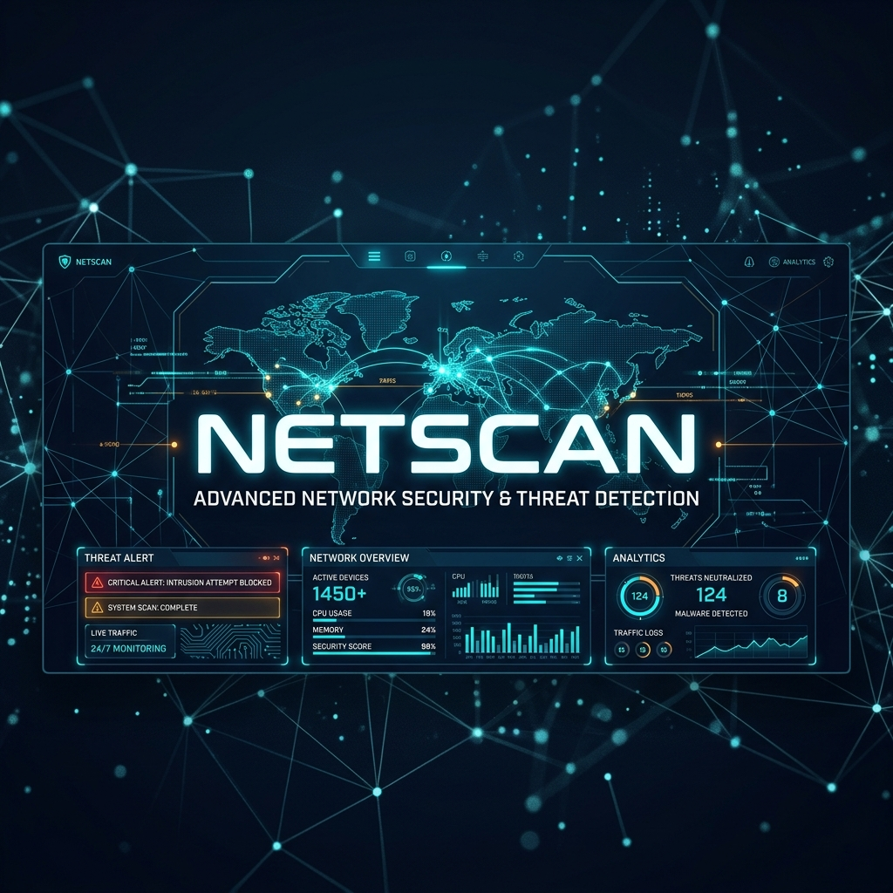
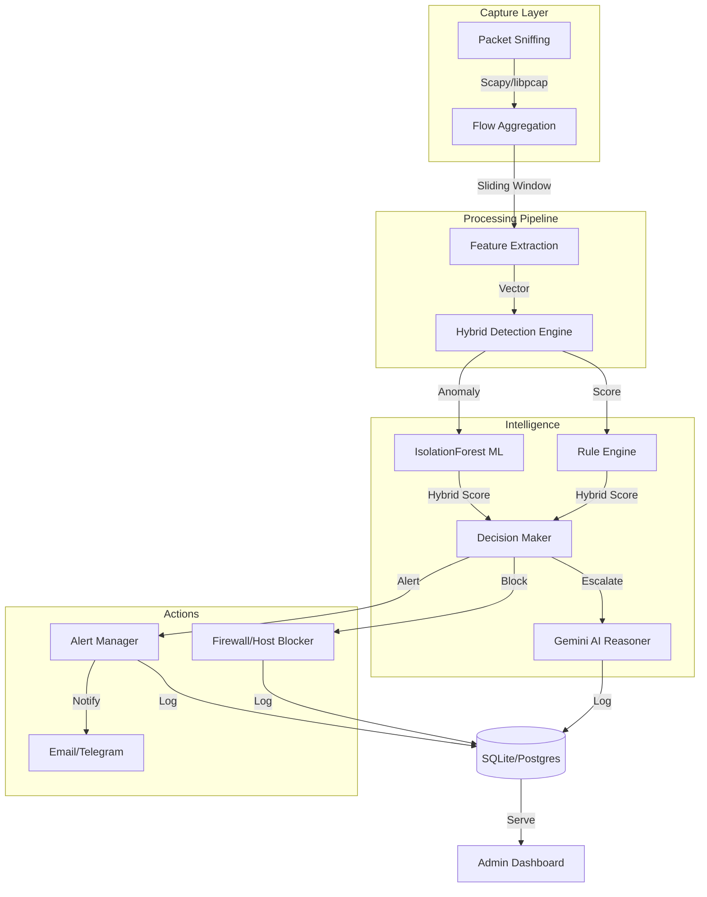
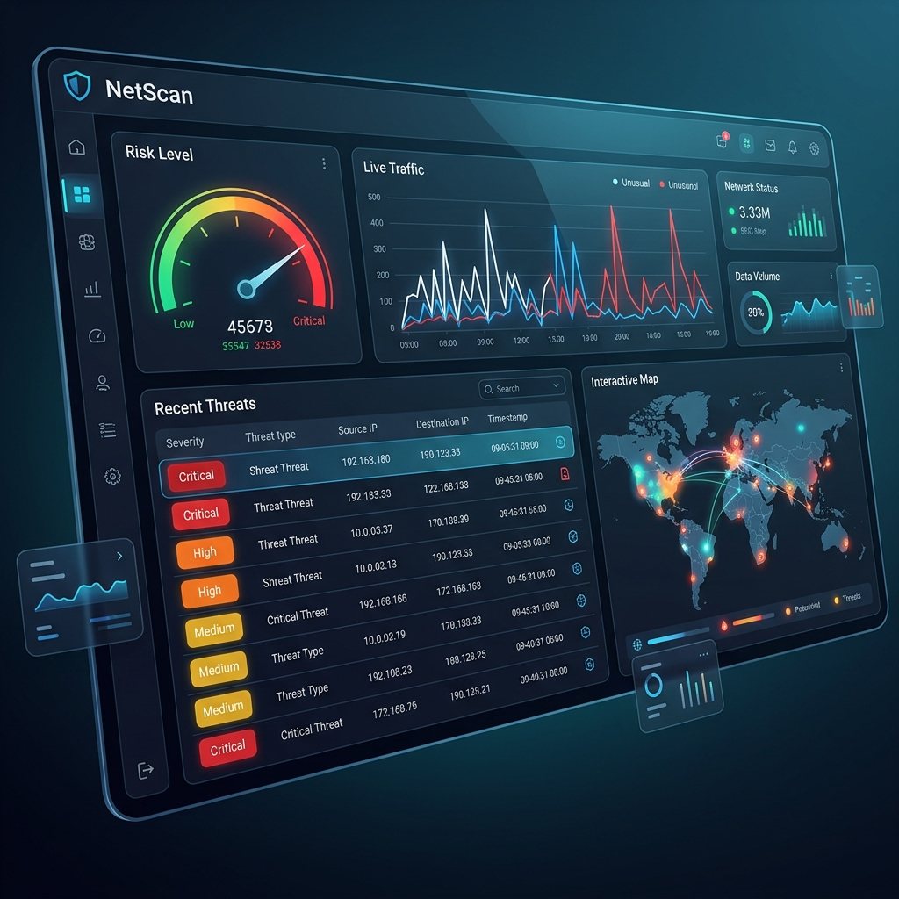

<div align="center">



# 🛡️ NetScan
### **Advanced Metadata-Only Network Intrusion Detection System**

[](https://www.python.org/downloads/release/python-390/)
[](https://opensource.org/licenses/MIT)
[]()
[]()

[**Explore Docs**](https://github.com/Desapphire/netscan#quick-start) • [**View Dashboard**](http://localhost:8000) • [**Report Bug**](https://github.com/Desapphire/netscan/issues)

---

**NetScan** is a near real-time, high-performance NIDS designed for modern corporate and campus environments. By focusing exclusively on network metadata, it provides deep visibility and proactive threat detection without compromising user privacy.

</div>

## ✨ Key Features

<table align="center">
  <tr>
    <td width="50%" valign="top">
      <h4>🔍 Hybrid Detection Engine</h4>
      Combines lightning-fast <b>Rule-based matching</b> with unsupervised <b>IsolationForest ML</b> for 99% accuracy.
    </td>
    <td width="50%" valign="top">
      <h4>🧠 AI-Powered Reasoning</h4>
      Escalates complex or ambiguous threats to <b>Google Gemini 2.0</b> for semantic context and deep analysis.
    </td>
  </tr>
  <tr>
    <td width="50%" valign="top">
      <h4>⚡ Real-Time Response</h4>
      Automated IP and Domain blocking via <b>nftables/iptables</b> and hosts-file redirection.
    </td>
    <td width="50%" valign="top">
      <h4>📊 Interactive Dashboard</h4>
      A modern, responsive web interface built with <b>FastAPI</b> and <b>Chart.js</b> for live monitoring.
    </td>
  </tr>
</table>

---

## 🏗️ Architecture



---

## 📸 Dashboard Preview


*Note: This is a representative mockup of the NetScan telemetry interface.*

---

## 🚀 Quick Start

### 1. Prerequisites (Linux)
```bash
sudo apt update
sudo apt install -y python3 python3-pip python3-venv libpcap-dev nftables iproute2
```

### 2. One-Shot Installation
```bash
git clone https://github.com/Desapphire/netscan.git
cd netscan
bash install_linux.sh
```

### 3. Launching
| Command | Mode | Description |
|---------|------|-------------|
| `python cli.py api` | **API Only** | Start dashboard at localhost:8000 |
| `sudo python cli.py live` | **Full Mode** | Auto-capture + Dashboard (Root required) |
| `sudo python cli.py train` | **Train** | Re-train ML model on baseline data |

---

## ⚙️ Configuration

Tunable parameters are located in `config/app_config.yaml`.

<details>
<summary><b>View Detection Parameters</b></summary>

| Key | Default | Description |
|-----|---------|-------------|
| `detection.rule_weight` | 0.70 | Rule engine importance |
| `detection.ml_weight` | 0.30 | ML model importance |
| `detection.block_threshold`| 0.75 | Risk level required to auto-block |
| `detection.ai_review` | 0.40 - 0.74 | Escalate to Gemini in this range |

</details>

<details>
<summary><b>View Gemini Setup</b></summary>

1. Set `gemini.enabled: true` in `config/app_config.yaml`.
2. Export your API key:
```bash
export GEMINI_API_KEY=<your-key>
```
</details>

---

## 🛠️ Tech Stack

- **Core**: Python 3.10+, Scapy, Pandas, Scikit-learn
- **API**: FastAPI, Uvicorn, Jinja2
- **Database**: SQLAlchemy, SQLite (Dev), Postgres (Prod)
- **Security**: nftables, iptables
- **AI**: Google Gemini Pro (Vertex AI / AI Studio)

---

## 📄 License

Distributed under the **MIT License**. See `LICENSE` for more information.

<div align="center">
  <br />
  Built with ❤️ by the <b>Desapphire</b> Team
</div>